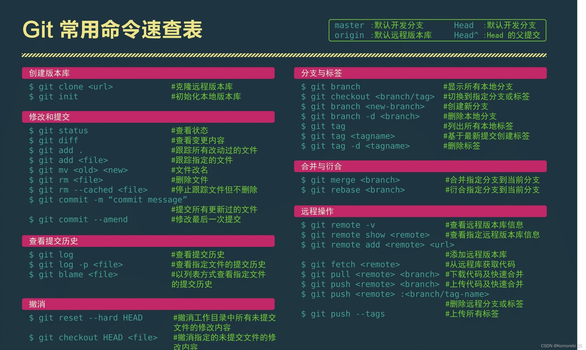

# git 基础



## 1.配置

- 增加配置列表

```sh
git config --global zhou.name '123'
```

- 改配置列表

```sh
git config --global --replace-all user.email "输入你的邮箱"
git config --global --replace-all user.email "输入你的用户名"
```

- 删配置列表

```sh
git config --global --unset zhou.name
```

- 查看配置列表

```sh
git config --list/git config -l
```

## 2.提交流程

工作区->暂存区->历史区->远程仓库 --这里默认为主分支

### 2.1 工作区-->暂存区（第一次提交要初始化本地仓库）

- 初始化本地仓库

```sh
git init
```

- 将工作区修改的内容添加到暂存区(单个文件、整个目录、所有文件)

```sh
git add [文件名称]/git add ./git add *
```

### 2.2 暂存区-->历史区

- 将暂存区中修改的内容提交到历史区（单个文件、全部文件）

```sh
git commit [文件名称] -m '提交的注释'/git commit -m '提交注释'
```

- 没有添加 -m
  - i 进入编辑模式
  - :wq 保存并退出
  - ：ql！ 退出

## 2.3 操作

- 创建文件

```sh
touch [文件名称]
```

- 查看工作区和暂存区那些文件修改（红色），查看暂存区和历史区那些文件修改（绿色）

```sh
git status -s/git status
```

- 查看工作区和暂存区内容差异

```sh
git diff
```

- 查看工作区和历史区内容差异

```sh
git diff --cached
```

- 查看历史区历史记录（如提交远程仓库记录）

```sh
git log/git log --oneline
```

- 前看看是否有分支

```sh
git branch
```

## 3.代码回退

### 3.1 git 没有关闭时代码回退

- 回退所有区域（历史区、暂存区、工作区）

```sh
git reset --hard
```

- 回退历史区和暂存区

```sh
git reset --mixed
```

- 回退历史区

```sh
git reset --soft
```

### 3.2 git 关闭后时代码回退

- 查看历史区版本号

```sh
git reflog
```

- 把历史区重置到(上一个提交、上上个提交、指定编号)

```sh
git reset --hard HEAD^/git reset --hard HEAD^^/git reset --hard HEAD@{编号}
```

- 把历史区重置到指定版本

```sh
git reset --hard [编号]
```

- 用历史区的内容覆盖暂存区的内容

```sh
git reset HEAD --[文件名称] /git reset HEAD -- .
```

- 用暂存区的内容覆盖本地工作区的内容（单个文件、所有文件）

```sh
git checkout -- [文件名称]/git checkout -- .
```

## 4.分支提交

- 有多个分支的情况：bug 分支、需求分支

- 查看分支

```sh
git branch
```

- 创建分支

```sh
git branch [分支名称]
```

- 切换分支

```sh
git checkout [分支名称]
```

- 合并分支（master 分支没有改动）

```sh
git merge [分支名称]
```

- 删除分支

```sh
git branch -d [分支名称]
```

- 创建分支并切换分支

```sh
git checkout -b [切换的分支名称]
```

- 合并分支（master 分支有更改，和现有的分支冲突）

```sh
git merge [分支]//出现冲突，代码中去解决冲突
git commit -m '分支合并'
```

- 分支提交日志

```sh
git log --graph --oneline
```

## 5.暂存工作内容

- 需求任务开发到一半，临时有一个紧急 bug 需要修复

- 把当前的工作区和暂存区保存到一个地方，并且用最新的历史区覆盖当前的工作区和暂存区

```sh
git stash
```

- 创建 bug 分支改 bug，提交后切换 master 分支合并

```sh
git merge bug
```

- 列出所有的储存区

```sh
git stash list
```

- 应用不删除

```sh
git stash apply
```

- 删除

```sh
git stash drop
```

- 应用删除

```sh
git stash pop
```

## 6.报错

- 提交远程仓库报错

  ```sh
  fatal: remote origin already exists.
  ```

  - 解决方法：删除历史区重新提交

- ssh 使用公钥授权不通过的问题解决
  - 用命令行 push 提交直接输入密码
